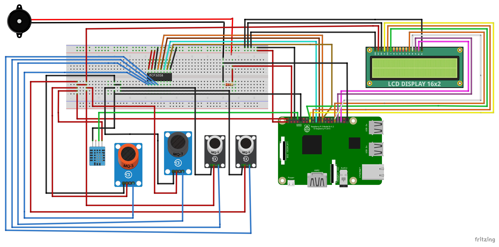
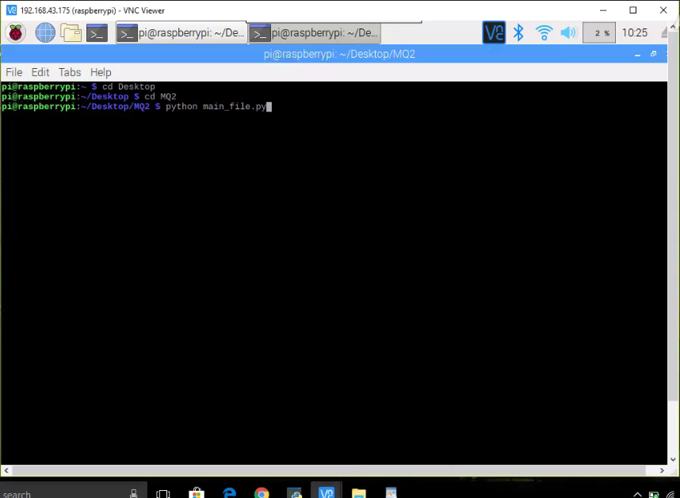
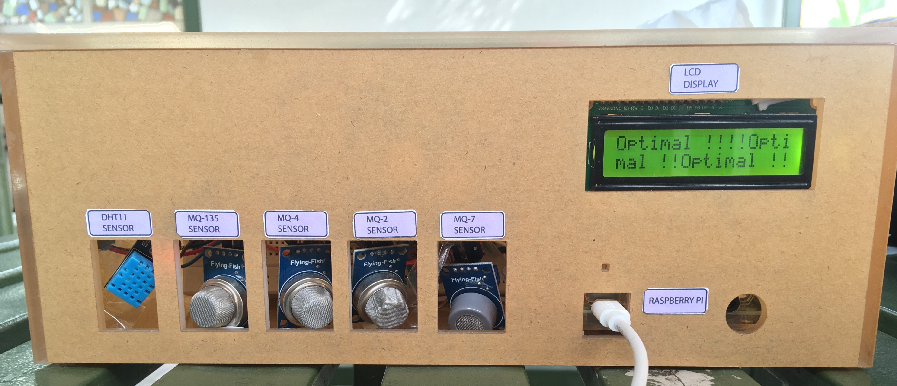
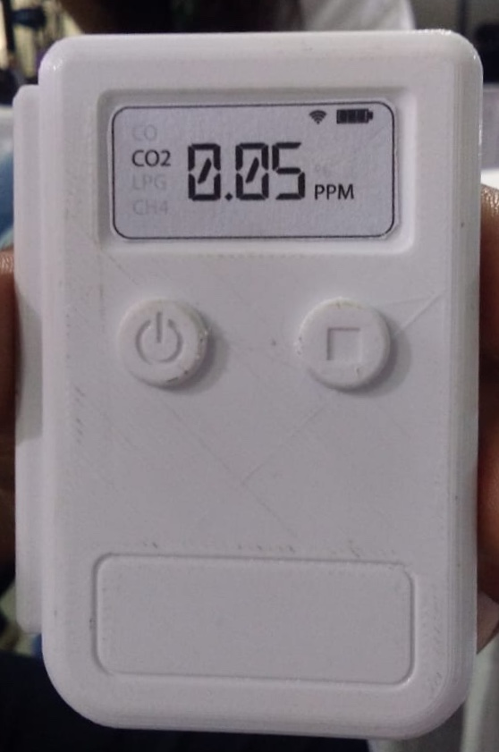

# Olfactro-Brainiac

Basic Idea :  https://bit.ly/2LKpgdW

Video Link : https://urlzs.com/AGDxv 

Connections :  

Hardware Devices used : 
                         1. Raspberry Pi 3B+
                         
                         2. MQ sensors
                         
                         3. dht11 
                         
                         4. MCP3008
                         
                         5. LCD 2*16
                         
                         6. Breadboard
                         
                         7. Buzzer
                         
                         8. Speakers

Software used :            Raspbian OS

How to run the code for predicting dangerous degree in the air :   

Final Product : 

Future Compact Product : 

Applications :  1. Food Quality (same circuit diagram as above)
                
                Run the main_file in Food_Code folder using command : python main_file.py  
                
                2. Krishi Parikshan
     
                       
